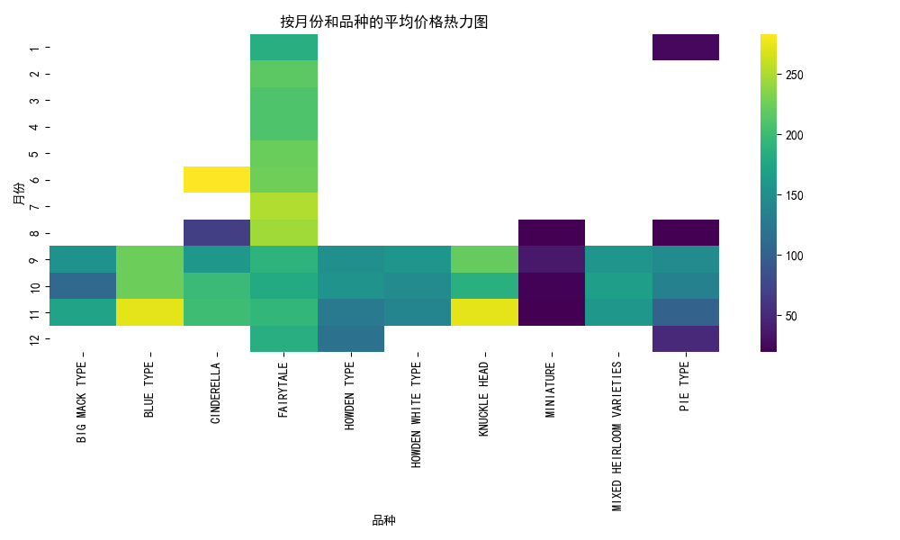

# 🎃 Pumpkin Price Analysis Project

本项目基于美国南瓜市场数据集 `US-pumpkins.csv` 进行探索性数据分析和建模，旨在揭示价格随时间、品种、城市等因素的变化规律，并利用线性回归模型进行预测。

---

## 📁 项目结构

```
pumpkin_price_analysis_project/
├── data/US-pumpkins.csv              # 原始数据集
├── notebooks/pumpkin_price_analysis.ipynb  # Jupyter 分析笔记本
├── src/analysis.py                   # 脚本分析模块
├── README.md                         # 项目说明文档
├── requirements.txt                  # 所需依赖列表
```

---

## ✅ 环境搭建

建议使用虚拟环境（venv）或 Conda：

```bash
python -m venv venv
venv\Scripts\activate      # Windows
# source venv/bin/activate  # macOS/Linux

pip install -r requirements.txt
```

---
说明模型在大致趋势判断上是有效的，但也存在一定误差。

---

## 🔍 数据分析

- **数据概览**：读取 `US-pumpkins.csv`，共包含 `Date`、`City Name`、`Variety`、`Low Price`、`High Price` 等字段。
- **缺失值检查**：确认无缺失或异常值，必要时进行填补或剔除。
- **描述性统计**：计算各品种、各城市、各月份的平均价格、方差和分位数，初步了解数据分布与差异。

## 🎯 问题构建

- **月度价格趋势分析**
- 探究南瓜市场的月度平均价格变化轨迹，识别长期上升或下降趋势及关键拐点。
- **品种间价格差异**
- 比较不同南瓜品种（及其子品种）的价格分布特征，分析平均价、中位数及波动范围的差异。
- **重点城市价格排名**
- 在销量排名前五的城市中，确定哪个城市的南瓜平均售价最高，并量化各城市间的价差。
- **年度季节性波动**
- 对每个月份的价格波动幅度（如标准差）和中位数水平进行分析，揭示全年季节性规律。
- **多变量价格预测模型**
- 基于时间特征（如年月、季节）与品种属性（如品种、等级、包装方式）构建预测模型，评估其对下月或下季度平均价格的预测能力。


## ⚙️ 特征处理

- **时间特征**  
  - 提取 `Year`、`Month` 和 `Year-Month`（做分组和绘图用）  
- **品种编码**  
  - 对 `Variety` 进行 One-Hot 编码，生成若干虚拟变量  
- **截距项**  
  - 在设计矩阵中手动添加全 1 列，作为线性回归的截距

## 🏗️ 构建模型

- **模型选择**：使用最简单的线性回归（NumPy 最小二乘）进行预测  
- **输入特征**：`[1, Year, Month, Var_*...]`  
- **输出目标**：`average_price`（高低价均值）  
- **实现方式**：调用 `np.linalg.lstsq` 求解正规方程

## 📈 模型评估

- **指标**：均方根误差（RMSE）  
- **结果**：  


## 🚀 项目概览

本项目使用 USDA 南瓜交易数据，演示从数据加载、可视化分析到回归建模的完整流程，并生成多种图表以辅助决策。

---

## 🔍 数据分析

- **数据概览**  
  - 原始数据字段：`Date`、`City Name`、`Variety`、`Low Price`、`High Price`  
  - 计算 `average_price = (Low Price + High Price) / 2`  
  - 提取时间字段：`Year`、`Month`、`YearMonth`

- **可视化**  
  1. 月度平均价格趋势  
       
  2. 不同品种价格分布  
       
  3. 销量前五城市平均价格  
       
  4. 各月价格分布  
       
  5. 各品种价格趋势  
       

---

## 🎯 问题构建

1. **趋势分析**：南瓜月度平均价格如何随时间变化？  
2. **品种差异**：不同品种价格分布有何显著差异？  
3. **区域对比**：销量最高的五座城市中，哪座城市的南瓜最贵？  
4. **季节波动**：各月价格波动幅度如何？  
5. **预测建模**：能否基于时间和品种信息预测平均价格？

---

## ⚙️ 特征处理

- **时间特征**  
  - `Year`、`Month`、`YearMonth`  
- **品种编码**  
  - 对 `Variety` 进行 One-Hot 编码  
- **截距项**  
  - 在线性模型设计矩阵中添加全 1 列  

---

## 🏗️ 构建模型

- **模型**：NumPy 最小二乘线性回归  
- **输入特征**：`[1, Year, Month, Var_*...]`  
- **目标变量**：`average_price`  
- **实现**：调用 `np.linalg.lstsq` 求解正规方程

---

## 📈 模型评估

- **评估指标**：均方根误差 (RMSE)  
- **结果**：  
```text
RMSE: 15.7629
```


- **散点图对比**：实际值 vs 预测值  
  
- **残差分布**  
  

---

## 🔧 改进与解释

  
## 📈 模型评估

- **评估指标**：均方根误差（RMSE）  
- **结果**：  
  - 多项式回归 交叉验证 RMSE：108.4967  
  - 线性回归 交叉验证 RMSE：78.2078  

> **分析**：  
> - 线性回归模型在时间序列交叉验证中表现优于二次多项式回归，说明数据的主要趋势更加线性；  
> - 多项式回归引入了大量高阶和交叉特征，虽能拟合更多细节，但在验证集上出现过拟合，导致误差反而增大；  
> - 后续可尝试正则化（如岭回归、Lasso）或更复杂的树模型，以平衡拟合能力与泛化能力。

**残差分析**  
 - 月度波动标准差  
     
 - SHAP / PDP 分析  

 - 
**热力图可视化**  
 - 按月 & 品种平均价格热力图  
     

---

